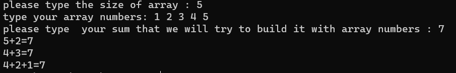
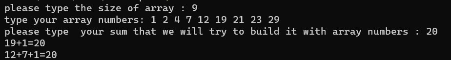
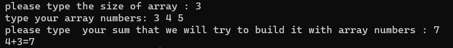

# ruby-recursive-build-sum

A recursive function to print all the ways can build an input number with sum of given array numbers.

## Preview





## Run
```bash
ruby recursive-build-sum.rb
```

<br>

[Original Project](https://github.com/hctilg/py-recursive-build-sum)
